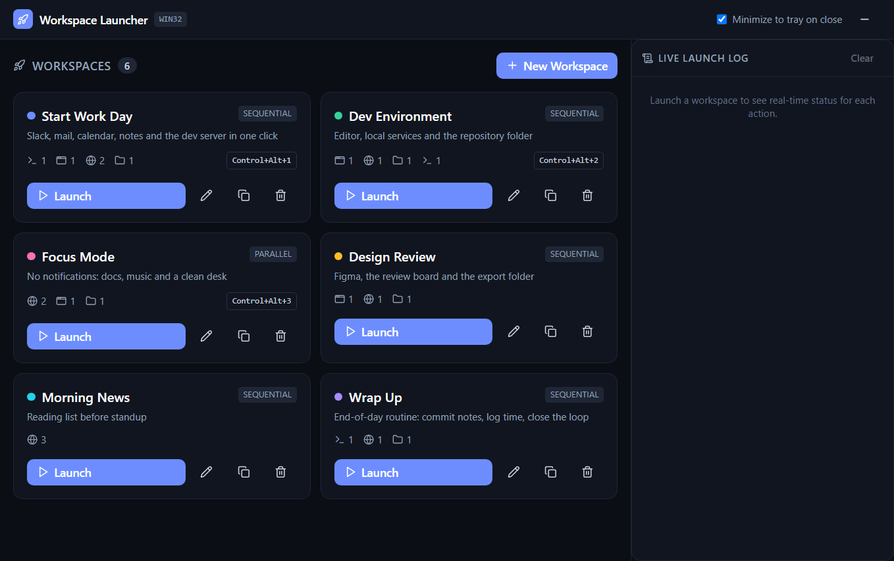
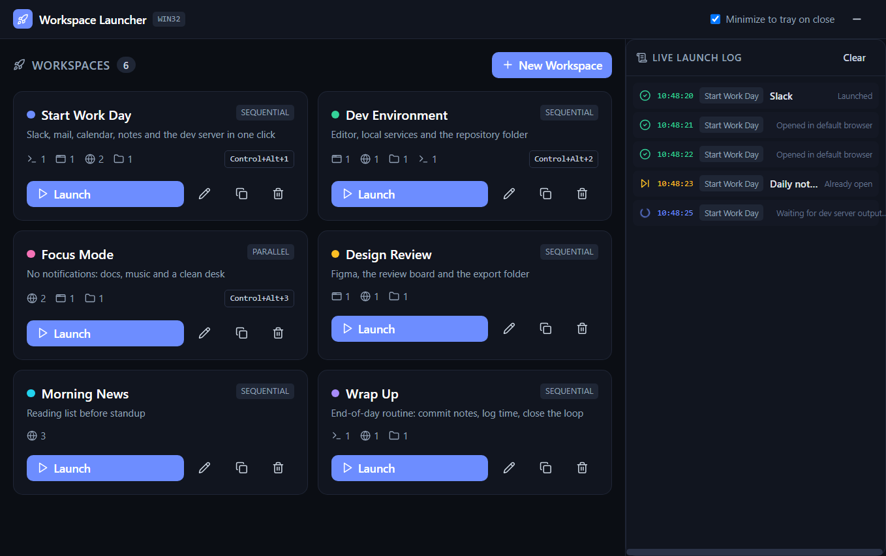
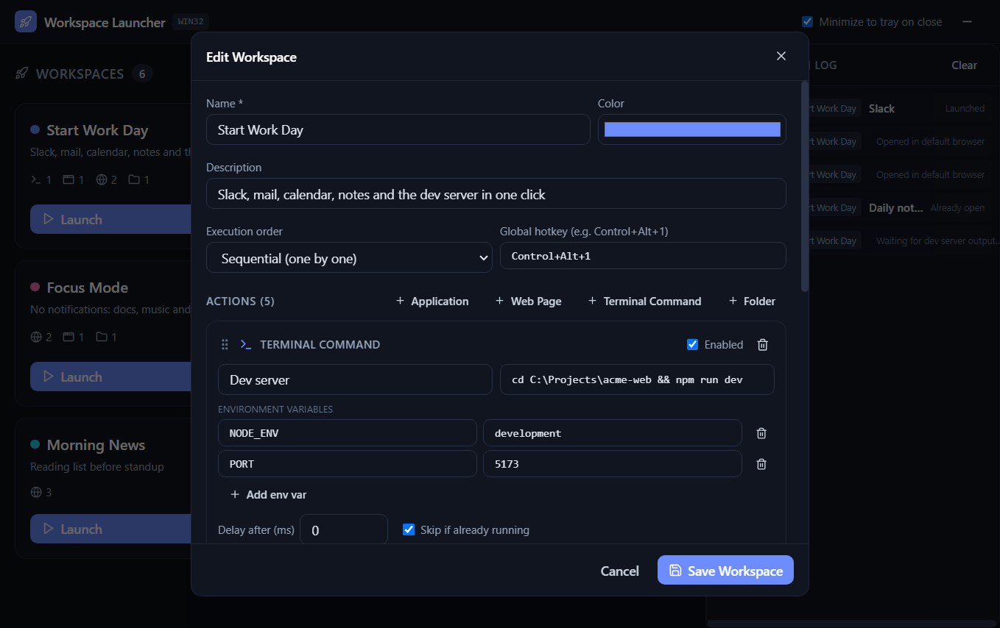

# Workspace Launcher

Launch your entire workspace — desktop apps, browser tabs, terminal commands, and project folders — with one click or a global hotkey.

Built with **Electron + React + TypeScript + Tailwind CSS**. State is persisted locally via `electron-store` (JSON in the OS user-data directory).



## Download

Grab the latest installer from the [**Releases**](https://github.com/komoizdead/workspace-launcher/releases/latest) page — Windows (x64) installer, no admin rights required. macOS (`.dmg`) and Linux (AppImage) builds can be produced from source with `npm run dist`.

> The Windows build is not code-signed, so SmartScreen may show a warning on first run: click **More info → Run anyway**.

## Features

- **Workspace profiles** — create, edit, duplicate, delete. Each profile is an ordered list of actions:
  - **Application** — path to a binary / `.app` bundle / desktop-entry name
  - **Web Page** — any URL, opened via the system browser
  - **Terminal Command** — shell command (PowerShell on Windows, `$SHELL -c` on macOS/Linux) with optional env vars
  - **Folder** — opens in Explorer / Finder / file manager
- **Drag-and-drop ordering**, per-action delay offsets (ms), enable/disable toggles
- **Sequential or parallel** execution per profile
- **Global hotkeys** — e.g. `Control+Alt+1` (Windows/Linux) or `Command+Alt+1` (macOS)
- **System tray** — minimize to tray; tray menu = quick-launch list of all profiles
- **Health checks** — optionally skip an action if its process or localhost port is already running
- **Live launch log** — real-time success / failure / skipped status per action

## Screenshots

*Live launch log — real-time status per action (success, skipped, running):*



*Workspace editor — drag-and-drop actions, per-action delays, env vars, global hotkeys:*



## Quickstart

```bash
npm install
npm run dev
```

`npm run dev` starts the Vite dev server (port 5173), bundles the Electron main/preload with esbuild, waits for both, then opens the app with DevTools detached.

## Other scripts

| Script | What it does |
|---|---|
| `npm run build` | Type-check, build renderer to `dist/`, bundle main/preload to `dist-electron/` |
| `npm start` | Run the app from the built output (requires `npm run build` first) |
| `npm run screenshots` | Regenerate the README screenshots into `assets/screenshots/` (runs the real app against throwaway demo data) |
| `npm run dist` | Package with electron-builder (NSIS on Windows, DMG on macOS, AppImage on Linux) |

## Project layout

```
workspace-launcher/
├── electron/
│   ├── main.ts                 # lifecycle, window, tray, single-instance lock
│   ├── IPC/
│   │   ├── systemLauncher.ts   # cross-platform spawn/open + health checks
│   │   └── storageHandler.ts   # electron-store CRUD, hotkey + tray wiring, IPC
│   └── preload.ts              # contextBridge API (`window.launcher`)
├── src/
│   ├── App.tsx                 # dashboard layout
│   ├── components/             # ProfileList, ProfileEditor (dnd-kit), LaunchLogger
│   ├── store/useStore.ts       # zustand state
│   └── types/workspace.ts      # shared Profile / Action / Log types
├── scripts/
│   └── capture-screenshots.cjs # regenerates the README screenshots
└── assets/                     # app icon, tray icon, README screenshots
```

## OS command mapping

| Action | Windows | macOS | Linux |
|---|---|---|---|
| Open app | `start "" "C:\...\app.exe"` | `open -a "App"` / `open App.app` | `gtk-launch` / `xdg-open` |
| Open URL | `shell.openExternal` (all platforms) | | |
| Run command | `powershell.exe -NoProfile -Command` | `$SHELL -c` | `$SHELL -c` |
| Open folder | `explorer.exe` | `open` | `xdg-open` |

## Notes

- Global hotkeys use Electron `accelerator` syntax; invalid accelerators are skipped with a console warning instead of crashing.
- A failed action never crashes the main process — it becomes a red entry in the launch log and the rest of the profile continues.
- Profiles, settings and hotkeys persist in the OS user-data folder (`%APPDATA%/workspace-launcher` on Windows).
